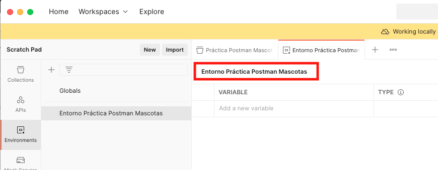
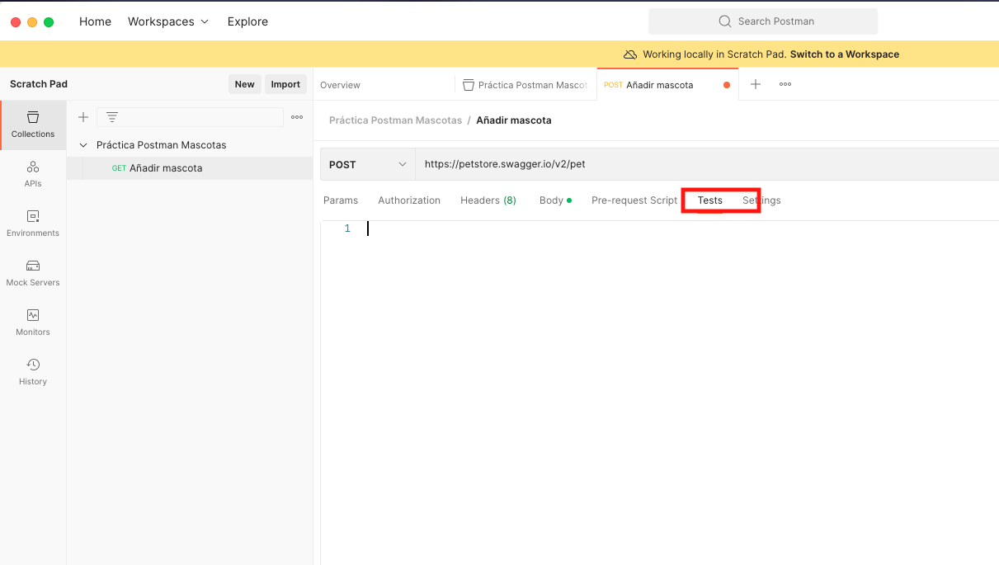
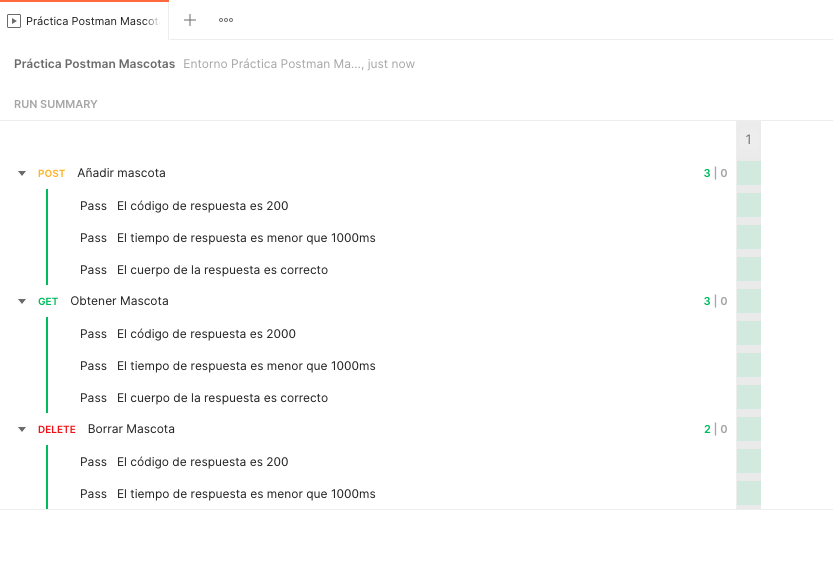

# Práctica de Postman

Vamos a ver algunas de las características de Postman a la hora de consumir una API. 

## Stack tecnológico
- [Postman](https://www.postman.com/), como plataforma para consumir una API.
- [PetStore Swagger](https://petstore.swagger.io), como API para realizar las pruebas.

## ¿Qué es Postman?

Es una herramienta que permite realizar peticiones HTTP a cualquier API. En este caso, vamos a probar una API REST

## ¿Qué es un API REST?


API REST define un conjunto de funciones para realizar solicitudes (Request) y recibir respuestas (Responses) a través del protocolo HTTP bajo una arquitectura cliente servidor. Utiliza los métodos (verbos) HTTP para realizar las peticiones, donde cada uno tiene una función en particular. Estos son los mas habituales:

- *GET:* Para solicitar datos o algún recurso.
- *POST:* Para enviar datos a un recurso para la creación.
- *PUT:* Para reemplazar por completo un recurso.
- *PATCH:* Para reemplazar parcialmente un recurso.
- *DELETE:* Para eliminar un recurso.
 
Los códigos de estado HTTP (HTTP Status Code) sirven para describir de forma abreviada la respuesta obtenida en las peticiones:

- *1XX:* Respuestas informativas
- *2XX:* Peticiones correctas
- *3XX:* Redirecciones
- *4XX:* Errores del cliente
- *5XX:* Errores del servidor

Se puede ver el significado de cada uno en el [Anexo de Códigos de respuesta](https://es.wikipedia.org/wiki/Anexo:C%C3%B3digos_de_estado_HTTP)

## Características de Postman

- *Colecciones:* Postman permite guardar/agrupar un conjunto de solicitudes (request), que se denominan Collections. Estas son carpetas en distintos niveles que organizan nuestras peticiones HTTP.
- *Variables de entorno y globales:* Las variables nos ayudarán a guardar y recordar valores para evitar escribir el mismo texto/ruta de forma repetitiva. Por lo que puede ser usado en los request y pruebas posteriores. Así mismo, estas pueden tener un ámbito global o de entorno.
- *Automatización de pruebas:* Postman permite ejecutar y validar un conjunto de pruebas de forma automatizada utilizando un Collection Runner. Una vez ejecutado, se mostrará el resultado resumen, indicando el tiempo de respuesta y el estado HTTP devuelto por el servidor.


## Swagger Petstore

Para realizar pruebas usaremos una API pública que proporciona Swagger que simula ser una tienda de mascotas:


Nos permite interactuar con mascotas, usuarios y la tienda. Vamos a usar las operaciones de añadir, obtener y eliminar mascotas.

### Añadir mascota

URL: [https://petstore.swagger.io/v2/pet](https://petstore.swagger.io/v2/pet)

Formato de la petición: json

Método HTTP: POST

Payload: Objeto Mascota 

Formato de la respuesta: json


```json
{
"id": 0,
"category": {
    "id": 1,
    "name": "Perros"
},
"name": "Yako",
"photoUrls": [
"https://purina.com.mx/sites/default/files/2022-12/nombres-para-perros-machos-02.png"
],
"tags": [
{
  "id": 1,
  "name": "marrón"
}
],
"status": "available"
}
```

### Obtener mascota por id

URL: https://petstore.swagger.io/v2/pet/{petId}

Método HTTP: GET

Formato de la respuesta: json

### Eliminar mascota por id

URL: https://petstore.swagger.io/v2/pet/{petId}

Formato de la petición: json

Método HTTP: DELETE

Formato de la respuesta: json

## Usando Postman para consumir la API

Iniciamos Postman y crearemos una colección:


La llamaremos _"Práctica Postman Mascotas"_:


Ademas añadiremos un _Enviroment_ 


Que llamaremos _"Entorno Práctica Postman Mascotas"_:



Fijaremos el entorno _"Entorno Práctica Postman Mascotas"_ en la colección _"Práctica Postman Mascotas"_


### Añadir una mascota

Añadimos una nueva petición:


Le damos un nombre _"Añadir mascota"_, establecemos la URL _https://petstore.swagger.io/v2/pet_, el verbo _POST_, y en el cuerpo del mensaje, definimos el tipo _raw/json_ y declaramos el mensaje:


Una vez establecidos estos campos podemos enviar la petición y en la parte inferior se puede ver la respuesta generada junto a algunos detalles de la misma como el código de respuesta, el tiempo que ha tardado y el tamaño de la respuesta


Podemos definir pruebas sobre la petición haciendo comprobaciones sobre los puntos anteriores, que el código de respuesta sea el esperado (200), que el tiempo de respuesta sea inferior a 1000 ms y que el cuerpo de la respuesta tenga valores correctos. 

Para ello, iremos a la pestaña test:



Y añadiremos el siguiente código Javascript:

```js
// Para tratar la respuesta, reemplazar posibles caracteres y obtener el JSON de respuesta
let responseBigIntsChangedToStrings = pm.response.text().replace(/([^"\w-])([-0-9.]{8,100})([^"\w-])/g, '$1\"$2\"$3');
let jsonResponse = [...responseBigIntsChangedToStrings.matchAll(/{.*}/g)];
let jsonData = JSON.parse(jsonResponse);

// Guardamos variables de entorno
pm.environment.set("idMascotaAProbar", jsonData.id);
pm.environment.set("nombreMascotaAProbar", jsonData.name);

// Pruebas sobre la operación de añadir mascota
pm.test("El código de respuesta es 200", function () {
    pm.response.to.have.status(200);
});

pm.test("El tiempo de respuesta es menor que 1000ms", function () {
    pm.expect(pm.response.responseTime).to.be.below(1000);
});

pm.test("El cuerpo de la respuesta es correcto", function () {
    pm.expect(jsonData.name).to.eql("Yako");
    pm.expect(jsonData.status).to.eql("disponible");
    pm.expect(jsonData.category.name).to.eql("Perros");
});
```
Ahora, al lanzar una petición podemos comprobar el estado de la misma en la pestaña _Test Results_


Además, hemos almacenados dos variables de entorno que podremos usar en peticiones posteriores. Esto permite hacer las pruebas de forma dinámica sin tener que andar cambiando cada valor después de cada prueba:

- idMascotaAProbar
- nombreMascotaAProbar

Para comprobar que se han creado y se les ha dado el valor correctamente, podemos ir a la pestaña _Enviroment_ y ver que están creadas:


Ahora podemos usarlas en otras peticiones y su valor irá cambiando cada vez que se use la operación de añadir mascota. Estas variables se pueden usar en la URL, en el body o en el código de las pruebas. De esta forma hacemos las pruebas mas robustas y fáciles de mantener.

### Obtener una mascota

Vamos a crear otra petición para obtener la mascota que acabamos de añadir. Para ello:


Le damos de nombre _Obtener Mascota_ y usamos la URL _https://petstore.swagger.io/v2/pet/{{idMascotaAProbar}}_ con el verbo _GET_


Al enviar la petición, podemos ver en la respuesta que nos recupera la mascota que hemos añadido antes:


Vamos a añdir test de comprobación de la respuesta de la misma forma que antes, comprobamos que el código de respuesta tiene el código 200, que el tiempo de respuesta es menor que 1000ms y que el cuerpo de la respuesta es correcto:

```js
let jsonData = pm.response.json();

// Pruebas sobre la operación de obtener mascota
pm.test("El código de respuesta es 200", function () {
    pm.response.to.have.status(200);
});

pm.test("El tiempo de respuesta es menor que 1000ms", function () {
    pm.expect(pm.response.responseTime).to.be.below(1000);
});

pm.test("El cuerpo de la respuesta es correcto", function () {
    pm.expect(pm.response.text()).to.include(pm.variables.get("nombreMascotaAProbar"));
});
```

Si volvemos a lanzar la petición con los test creados, vemos que son correctos:


### Borrar una mascota

Vamos a crear una petición para borrar la mascota que hemos creado. Para ello añadimos una nueva petición


Le damos el nombre _Borrar Mascota_, con el verbo _DELETE_ y la URL: _https://petstore.swagger.io/v2/pet/{{idMascotaAProbar}}_. Podemos añadir los test para comprobar el código de respuesta de la petición y el tiempo de respuesta:

```js
//  Pruebas sobre la operación de borrar mascota
pm.test("El código de respuesta es 200", function () {
    pm.response.to.have.status(200);
});
pm.test("El tiempo de respuesta es menor que 1000ms", function () {
    pm.expect(pm.response.responseTime).to.be.below(1000);
});
```

Al lanzarlo la primera vez, vemos que los test son correctos: Se ha borrado la mascota y el tiempo de respuesta es menor de 1000ms


Pero al lanzarlo por segunda vez, como la mascota ya ha sido borrada anteriormnete, el test del código de repuesta es incorrecto, ahora devuelve un código 404 correspondiente al mensaje "Not Found":


### Variables globales

Las variables globales son útiles cuando no queremos repetir código con valores constantes. Por ejemplo, la URL del API (_https://petstore.swagger.io/v2/pet_) es el mismo para todos los casos por lo que es conveniente convertirla a una variable global.

Para ello, en la pestaña _Collections_, en la colección que hemos creado _Práctica Postman Mascotas_ podemos añadir una Variable llamada _PETSTORE\_API\_URL_ con el valor inicial _https://petstore.swagger.io/v2/pet_:


Ahora podemos ir a las 3 peticiones que hemos creado: (_Añadir mascota_, _Obtener Mascota_ y _Borrar Mascota_) y cambiar la URL para usar la variable global:

- Añadir mascota: {{PETSTORE_API_URL}}


- Obtener Mascota: {{PETSTORE_API_URL}}/{{idMascotaAProbar}}


- Borrar Mascota: {{PETSTORE_API_URL}}/{{idMascotaAProbar}}


### Ejecutar las pruebas

Para ejecutar las pruebas, vamos a la opción _Runner_ (abajo a la derecha):


Arrastramos dentro de ella la colección _Práctica Postman Mascotas_:


Podemos fijar el número de iteraciones y un tiempo entre ellas y le damos a _Run_:




### Exportar colecciones y entornos

Una de las opciones mas útiles de postman es que las colecciones y los entornos se pueden exportar en ficheros JSON para poder trazarlos y compartirlos. 
para ello, podemos ir a _Collections_ --> _Export_ para exportar la colección 


y _Enviroments_ --> _Export_ para el entorno:


